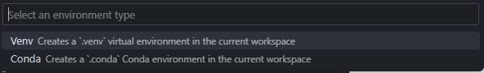
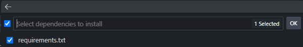

<div align='center'>


# GSpy

GSpy es una aplicación que permite el resumen y la traducción de los mejores documentos académicos encontrados en Google Scholar.

</div>

## Dependencias

Las dependecians se pueden encontrar en el fichero [Requirements](requirements.txt).

* scholarly: Implementa Google Scholar API para python.
* numpy: Funciones de utilidad matemática, como puede ser la media o la ordenación de elementos.
* PyPDF2: Extracción del contenido dentro de los PDFs.
* nltk: Procesamiento de lenguaje natural, como la tokenización de palabras o frases.
* translate: Implementa Google Translate API para python.

## Estructura

* [Data](data): Contiene los PDFs relacionados a la temática que el usuario pide.
* [Docs](docs): Contiene todos los recursos usados para la documentación.
* [Out](out): Contiene todos los resumenes realizados, tanto los originales como los traducidos.
* [Src](src): Contiene el codigo fuente.
    * [Init](src/__init__.py): Contiene todo los pasos previos que la aplicación necesita para el despliegue de esta.
    * [Main](src/main.py): Punto de entrada para la aplicación.
    * [Natural Language](src/natural_language.py): Procesamiento del lenguaje natural de los articulos.
    * [Recommendation](src/recommendation.py): Sistema de recomendación de artículos.
* [Gitignore](.gitignore): Contiene una lista de ficheros que no son interesantes de guardar.
* [README](README.md): Es el documento que estas leyendo.
* [Requirements](requirements): Contiene los paquetes dependencia del proyecto.

## Depliegue

Se recomienda usar Visual Studio Code con la extension Pytho y tener instalada una versión de python entre 3.8.10 y 3.12.0.

1. Dirijase al directorio donde quiere instalar la aplicación.
2. Descomprime el proyecto o clona con git el repositorio.

```shell
git clone https://github.com/SammyHM/RRT.git
```
3. Crea un entorno python preferiblemente venv.

### Shell

```shell
python3 -m venv .venv
pip install requirements.txt
```

### Visual Studio

> 1. Instala la extensión *Python*.
> 2. Pulsa *Ctrl+Shift+p* y selecciona *Python: Create Environment...*
> 3. Selecciona el tipo de entorno
> 4. Añade el fichero requirements.txt como dependencia.

<div align='center'>




</div>

4. Espera a que termine la instalación
5. Ejecuta el script [main.py](src/main.py).

## Funcionamiento

1. Se pide al usuario un tema para buscar, debe ser en Inglés (se implementará para otros idiomas en versiones futuras).

2. Sistema de Recomendación: Se realiza el proceso de búsqueda de publicaciones relacionadas, su selección y se descargará el pdf asociado en la carpeta [data](data).

3. Resumen del contenido: Se realiza un resumen mediante técnicas de reducción del contenido y se muestra la ruta del fichero de texto resultante alojada en la carpeta [out](out).

4. Traducción del contenido: Se pide al usuario un idioma válido, se aplica la traducción sobre el contenido resumido y se muestra la ruta del fichero de texto resultante alojada en la carpeta [out](out). Este proceso se repite hasta que el usuario escriba *quit*.

```console
1.- What topic do you whant to search? _ (Insert topic)

2.- Searching for publications...
Picking the best publication...
Best article found is: {Name}
Link: {Link}
Fetching data...

3.- Summarizing its contents...
Saved summary at {file location}

4.- Available languages: {languages}
Type "quit" to exit translation process.
Repeats:
    Select a valid language: _ (Insert language | quit)
    Translating document to {language}...
    Saved translation at: {new file location}

```

# Ejemplo

<div align='center'>

[](docs/video/example.mkv)

</div>

# Bibliografía

* [Natural Language Tool Kit.](https://www.kaggle.com/code/imkrkannan/text-summarization-with-nltk-in-python)
